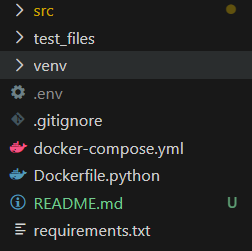

How to Use

Steps
1. Run in terminal:
   - python -m venv venv
   - venv/Script/activate
   - pip install -r requirements.txt
2. After finish installing libraries, create a .env file in the root folder. Inside the .env file input your personal Gemini API key in the format of GEMINI_API_KEY=<Your API Key>.

3. Run main.py. You'll have to wait a while when running for the first time due to it downloading the QDrant embedding models but it will run smoothly afterwards.
